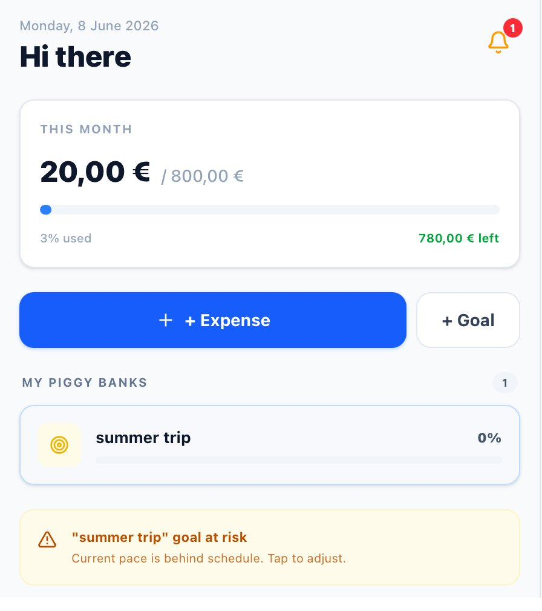
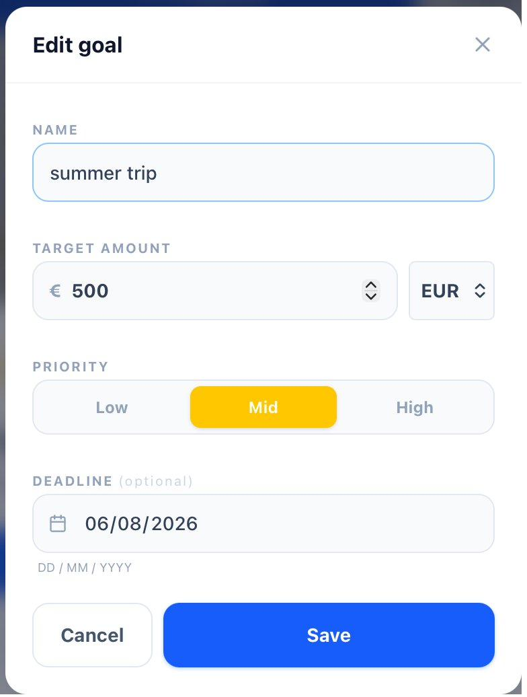
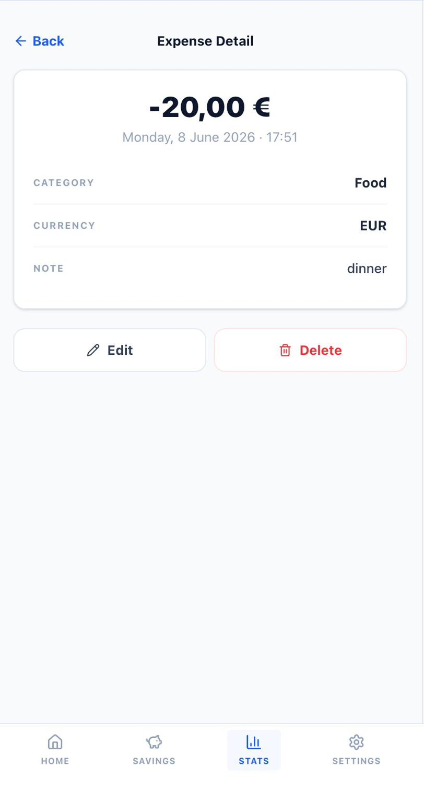
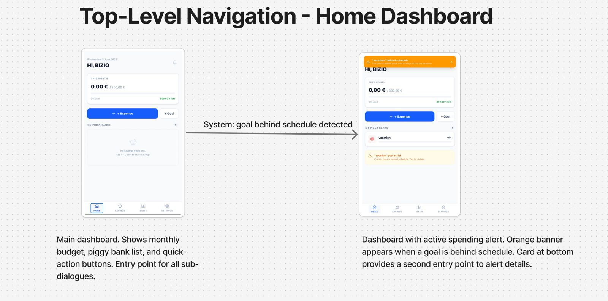
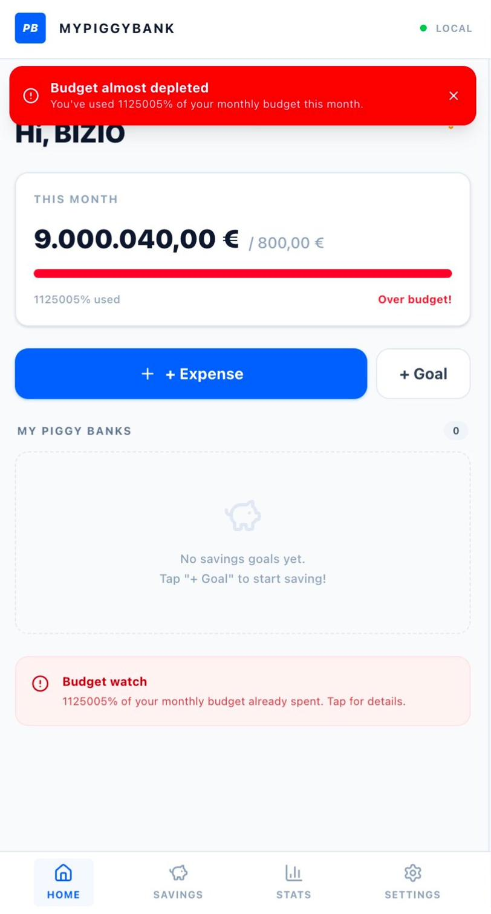
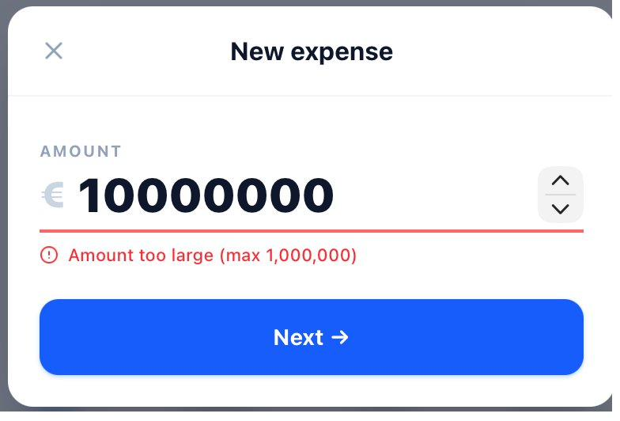

# MyPiggyBank

**A local-first savings app designed with its users, not for them.**

MyPiggyBank is a personal budgeting app for people with irregular incomes and many small goals (students, freelancers, young workers). The idea is to bring back the mindful feeling of the old ceramic piggy bank: you log each expense yourself, see at a glance where your money goes, and your data never leaves your phone.

It was built as a team project (5 people) for the **User-Driven Software Engineering** course at Sapienza University of Rome (spring 2026), following a full user-centred design process: survey, personas, task analysis, dialogue modelling, mockups, expert evaluation, user testing and a controlled experiment.

[**Read the full report (PDF, 67 pages)**](report/MyPiggyBank_report.pdf) · [**Try the prototype**](https://emasmisi.github.io/mypiggybank/)

<p align="center">
  
  &nbsp;
  
  &nbsp;
  
</p>

## What the app does

- **Fast manual expense entry**: two to four taps, about 6 seconds by the Keystroke-Level Model.
- **Multiple savings goals** ("piggy banks") with target, priority and optional deadline.
- **Weekly and monthly summaries** with drill-down to single expenses.
- **Recurring expenses** pre-loaded and deducted automatically (an idea that came from a survey answer).
- **Spending alerts** when a goal falls behind schedule, with a shortcut to adjust it.
- **Local-only storage** with JSON/CSV export: no bank account, no sign-up, no tracking.
- **Multi-currency** support.

## How we designed it

| Step | What we did | What it changed |
|---|---|---|
| **User research** | Online questionnaire with 30+ respondents, 3 personas, scenarios, competitor analysis (MoneyBox, Revolut, the physical piggy bank) | Privacy scored 4.1/5, so local-first became a hard constraint. Monthly summaries beat progress charts (16 votes vs 7), so the home page was redesigned around them. |
| **Task analysis** | Hierarchical Task Analysis of how people save today (AS-IS) | Defined the 9 functional requirements |
| **Dialogue design** | State Transition Networks: one top-level network and 5 sub-dialogues (expense entry, piggy banks, reports, settings, alerts) | Every screen and transition made explicit before building anything |
| **Prototype Zero** | Mockups and interaction flows for each sub-dialogue | |
| **Expert evaluation** | Heuristic evaluation (Nielsen) and cognitive walkthrough | Found 3 severity-3 issues: unbounded budget figure, no way to undo a wrong expense, alert shortcut not wired |
| **Prototype One** | Fixed all issues found | |
| **User testing** | Think-aloud study with 5 target users, 3 tasks each | All tasks completed; one mis-click raised the question below |
| **Controlled experiment** | Between-groups test with 12 users: deposit button on the goal card (A) or inside the goal page (B) | A was faster on average (9.4 s vs 11.4 s), but a one-way ANOVA showed the difference is not significant (F = 1.19, p = 0.30). We reported it as such. |

### Mockups



More flows in [`docs/mockups`](docs/mockups): expense entry, piggy bank management, reports, settings and alerts.

### Before and after the expert evaluation

<p align="center">
  
  &nbsp;&nbsp;
  
</p>

*Left: Prototype Zero shows "1125005% used" after an out-of-range amount. Right: Prototype One rejects it with an inline error.*

## Repository

```
report/        final project report (PDF)
docs/
  mockups/       interaction flows of Prototype Zero
  prototype-one/ screenshots of the corrections in Prototype One
  survey/        charts from the questionnaire
prototype/     source code of the clickable prototype
```

## The prototype

The prototype is a React + TypeScript web app (Vite, Tailwind CSS) that stores everything in the browser's `localStorage`. It was built quickly with AI-assisted tools, on purpose: its job was to be a realistic artefact for the evaluations, while the focus of the project was the design process.

```bash
cd prototype
npm install
npm run dev     # http://localhost:3000
```

## Team

Jacopo Rossi, Fabiano Cacioli, Emanuele Smisi, Luca Buonomini, Fabrizio Pietrobono.

Course: User-Driven Software Engineering, Master's in Engineering in Computer Science and Artificial Intelligence, Sapienza University of Rome, A.Y. 2025/26.
